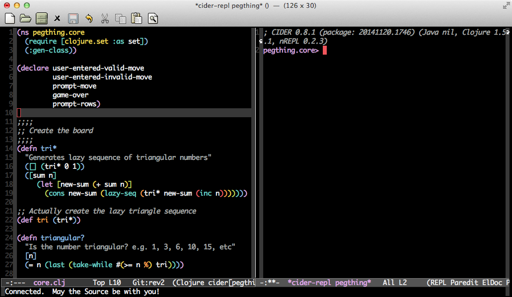
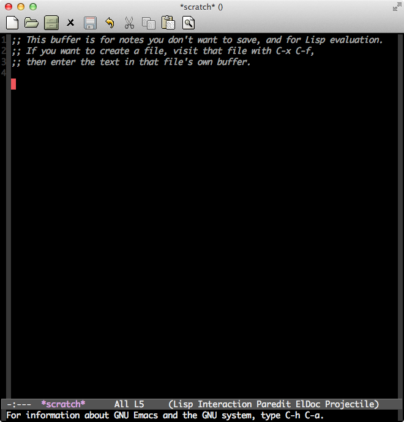
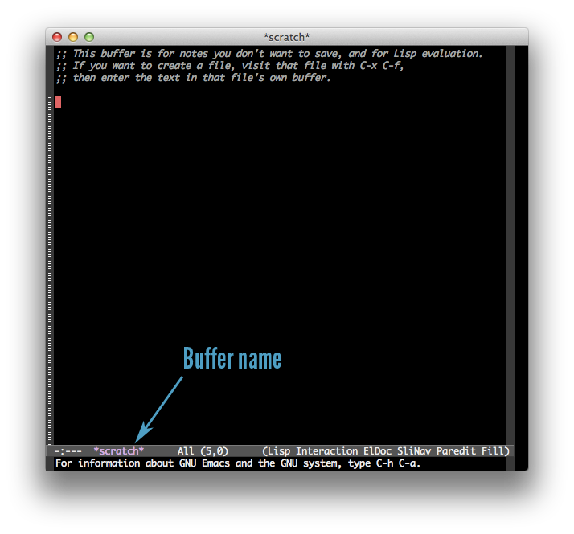
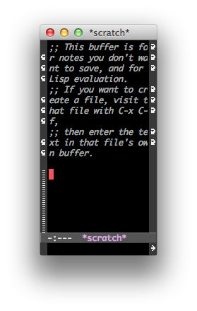

# Start Using Emacs

On your journey to Clojure mastery, your editor will be your closest
ally. You can, of course, use any editor you want. Some get pretty
close to Emacs's Clojure functionality.

The reason I recommend Emacs, however, is that it offers tight
integration with a Clojure REPL. This allows you to instantly try out
your code as you write. That kind of tight feedback loop will be
useful both when learning Clojure and, later, when writing real
Clojure programs. Emacs is also great for working with any Lisp
dialect; Emacs itself is written in a Lisp dialect called Emacs Lisp.

If you don't follow the thorough Emacs instructions in this chapter,
then it's still worthwhile to invest time in setting up your editor to
work with a REPL.

By the end of this chapter, your Emacs setup will look something like
this:



To get there, we'll do the following:

- Install Emacs
- Install a new-person-friendly Emacs configuration

After we're done installing and setting up Emacs, we'll cover:

- Opening, editing, and saving files
- Basic Emacs concepts
- Essential Emacs key bindings

In the next chapter, we'll cover:

- Editing Clojure code
- Interacting with the REPL

## Installation

You should use the latest major version of Emacs, Emacs 24.

- **OS X**: [Install vanilla Emacs as a Mac app](http://emacsformacosx.com/). There are other options,
  like Aquamacs, which are supposed to make Emacs more "Mac-like", but
  they're problematic in the long run because they're set up so
  differently from standard Emacs that it's difficult to use the Emacs
  manual or follow along with tutorials
- **Linux**: A recent version of Emacs is available directly from the package
  manager of most Linux distributions. For **Ubuntu**, follow
  [these instructions](https://launchpad.net/~cassou/+archive/emacs).
- **Windows**: You can find a binary
  [at the bottom of this page](http://ftp.gnu.org/gnu/emacs/windows/).
  Alternatively, you can install Emacs with a
  [single command](https://chocolatey.org/packages?q=emacs)
  using [chocolatey](https://chocolatey.org/).

After you're done installing Emacs, open it up. You should see
something like this:


Welcome to the Cult of Emacs! You've made Richard Stallman proud!

## Configuration

I've created a
[github repo](https://github.com/flyingmachine/emacs-for-clojure)
which contains all the files you need to get started. Just do the
following to use it:

1. Close Emacs
2. Delete `~/.emacs` or `~/.emacs.d` if they exist
3. Run `git clone
   https://github.com/flyingmachine/emacs-for-clojure.git ~/.emacs.d`
4. (Optional) delete the `.emacs.d/.git` directory. You'll probably
   want to create your own git repo for `.emacs.d`
5. Create the file `~/.lein/profiles.clj` and add the line `{:user
   {:plugins [[cider/cider-nrepl "0.8.1"]]}}` to it
6. Open Emacs

When you open Emacs you should see this:



Now that we've got everything set up let's learn how to use Emacs!

## Emacs Escape Hatch

Before we dig into the fun stuff, you need to know an important Emacs
key binding: Control+g. This key binding quits whatever Emacs command
you're trying to run. So if things aren't going right, hold down the
"control" key and press "g" and then try again. It won't close Emacs
or make you lose any work; it'll just cancel your current action.

## Emacs Buffers

All editing happens in an Emacs **buffer**. When you first start Emacs,
a buffer named `*scratch*` is open. Emacs will always show you the
name of the current buffer, as shown here:



By default, the scratch buffer behaves in a way that's optimal for
Lisp development. Let's go ahead and create a fresh buffer so that we
can play around without having unexpected things happen. To create a
buffer, do this:

- Hold down Control and press x
- Release Control
- Press b

Since that is very wordy, let's express the same sequence in a compact
format:

```
C-x b
```

Once you perform the above key sequence, you'll see a prompt at the
bottom of the application:


This area is called the **minibuffer** and it's where Emacs prompts
you for input. Right now it's prompting us for a buffer name. You can
enter the name of a buffer which is already open, or you can enter a
new buffer name. Let's enter `emacs-fun-times` and hit `enter`.

You should now see a completely blank buffer. Go ahead and just start
typing stuff. You should find that keys mostly work the way you'd
expect:

- Characters show up as you type them
- The up, down, left and right arrow keys move you as you'd expect
- Enter creates a new line

You'll also notice that you're not sporting a bushy Unix beard or
birkenstocks unless you had them to begin with. This should help ease
any lingering trepidation you feel about using Emacs.

When you're done messing around, go ahead and **kill** the buffer:

```
C-x k enter
```

Sidenote: it might come as a surprise, but Emacs is actually quite
violent, making ample use of the term "kill."

Now that you've killed the "emacs-fun-times" buffer, you should be
back in the `*scratch*` buffer. In general, you can create as many
new buffers as you want with `C-x b`. You can also quickly switch
between buffers using the same command.

When you create a new buffer this way, it exists only in memory until
you save it as a file. Let's learn about working with files.

## Working with Files

Here's the key binding for opening a file in Emacs:

```
C-x C-f
```

Notice that you'll need to hold down the Control key when pressing
both "x" and "f".

After you do that, you'll get another minibuffer prompt. Go ahead and
navigate to `~/.emacs.d/customizations/ui.el`, a user-defined file
customizing the way Emacs appears and how you can interact with it.
Emacs opens the file in a new buffer, and the buffer's name is the
same as the filename.

Let's go to line 37 and uncomment it by removing the semi-colons. It
will look like this:

```cl
(setq initial-frame-alist '((top . 0) (left . 0) (width . 177) (height . 53)))
```

Then change the values for `width` and `height`. Width is the number
of characters wide, and height is the number of lines high. By
changing these values, you won't have to resize Emacs every time it
starts. Go with something small at first, like 80 and 20:

```cl
(setq initial-frame-alist '((top . 0) (left . 0) (width . 80) (height . 20)))
```

Now save your file with the following key binding:

```
C-x C-s
```

You should get a message at the bottom of Emacs like `Wrote
/Users/snuffleupagus/.emacs.d/customizations/ui.el`. Also go ahead and try saving
your buffer using the key binding you use in every other app. For me,
it's &#8984;-s. The Emacs config you downloaded should allow that to
work, but if it doesn't that's no big deal!

After saving the file, go ahead and quit Emacs and start it again. I
bet it's really tiny!



Go through that same process a couple times until Emacs starts at a
size that you like. Or just comment those lines out again and be done
with it. If you're done editing `ui.el`, you can close its buffer
with `C-x k`. Either way, you're done saving your first file in Emacs!
If something crazy happens, just use git to revert your changes.

If you want to create a new file, just do `C-x C-f` and enter the new
file's path in the minibuffer. As soon as you save the buffer, Emacs
will create a file with the buffer's contents at the path you entered.

Let's recap:

1. In Emacs, editing takes place in *buffers*
2. To switch to a buffer, do `C-x b` and enter the buffer name in the
   *minibuffer*
3. To create a new buffer, do `C-x b` and enter a new buffer name
4. To open a file, do `C-x C-f` and navigate to the file
5. To save a buffer to a file, do `C-x C-s`.
6. To create a new file, do `C-x C-f` and enter the new file's path.
   When you save the buffer, Emacs will create the file on the file
   system.

## Key Bindings and Modes

You've already come a long way! You can now use Emacs like a very
basic editor. This should help you get by if you ever need to use
Emacs on a server or are forced into pairing with an Emacs nerd.

To really be productive, however, it'll be useful to go over some
"key" details about key bindings (ha ha!). Then I'll introduce Emacs
"modes". After that, I'll cover some core terminology and go over a
bunch of super useful key bindings.

### Key Bindings / Emacs is a Lisp Interpreter

The term *key binding* derives from the fact that Emacs binds
*keystrokes* to *commands*, which are just *elisp functions* (I'll use
"command" and "function" interchangeably). For example, `C-x b` is
bound to the function `switch-to-buffer`. Likewise, `C-x C-s` is bound
to `save-file`.

But it goes even further than that. Even simple keystrokes like `f`
and `a` are bound to a function, in this case `self-insert-command`.

From Emacs's point of view, all functions are created equal. You can
redefine functions, even core functions like `save-file`. You probably
won't *want* to, but you can.

You can redefine functions because, at its core, Emacs is "just" a
Lisp interpreter which happens to load code editing facilities. From
the perspective of Emacs, `save-file` is just a function, as is
`switch-to-buffer` and almost any other command you can run. Not only
that, any functions *you* create are treated the same as any built-in
functions. You can even use Emacs to execute elisp, modifying Emacs as
it runs.

The freedom to modify Emacs using a powerful programming language is
what makes Emacs so flexible and why people like myself are so crazy
about it. Yes, it has a lot of surface of complexity which can take
time to learn. But underlying it is the elegant simplicity of Lisp and
the infinite tinkerability which comes with it.

This tinkerability isn't limited to just creating and redefining
functions. You can also create, redefine, and remove keybindings.
Conceptually, keybindings are just an entry in a lookup table
associating keystrokes with functions. That lookup table is completely
modifiable.

You can also run functions by name, without a specific keybinding,
using `M-x {function-name}`, e.g. `M-x save-buffer`. "M" stands for
"meta", a key which modern keyboards don't possess but which is
usually mapped to "Alt" or "Option". `M-x` runs the `smex` command,
which prompts you for the name of another command to be run.

Now that we understand key bindings and functions, we can understand
what modes are and how they work.

### Modes

An Emacs **mode** is primarily a collection of key bindings and
functions which are packaged together to help you be productive when
editing different types of files. Modes also do things like tell Emacs
how to do syntax highlighting but I think that's of secondary
importance and we won't cover that.

For example, when editing a Clojure file you'll want to load
Clojure mode. Right now I'm writing a Markdown file and I'm using
Markdown mode. When editing Clojure, we'll make use of the key
binding `C-c C-k` to load the current buffer into a REPL and compile
it.

Modes come in two flavors: *major* modes and *minor* modes. Markdown
mode and Clojure mode are both major modes. Major modes are usually
set by Emacs when you open a file, but you can also set the mode
explicitly with e.g. `M-x clojure-mode` or `M-x major-mode`; you set
a mode by running the relevant Emacs command. Only one major mode is
active at a time.

Whereas major modes specialize Emacs for a certain file type, minor
modes usually provide functionally that's useful across many file
types. For example, abbrev mode "automatically expands text based on
pre-defined abbreviation definitions" (per the
[Emacs manual](http://www.gnu.org/software/emacs/manual/html_node/emacs/Minor-Modes.html#Minor-Modes)).
You can have multiple minor modes active at the same time.

You can see which modes are active on the **mode line**:


If you open a file and Emacs doesn't load a major mode for it, chances
are that one exists. You'll just need to download its package&#x2026;

### Installing Packages

A lot of modes are distributed as `packages`, which are just bundles
of elisp files stored in a package repository. Emacs 24, which you
should have installed, makes it very easy to browse and install
packages. `M-x package-list-packages` will show you almost every
package available just make sure you run `M-x
package-refresh-contents` first so you get the latest list. You can
install packages with `M-x package-install`.

You can also customize Emacs by loading your own elisp files or files
you find on the Internet. [This guide](http://www.masteringemacs.org/articles/2010/10/04/beginners-guide-to-emacs/) has a good description of how to
load customizations under the section "Loading New Packages" toward
the bottom of the article.

## Core Editing Terminology and Key Bindings

If all you want to do is use Emacs like Notepad, then you can skip
this section entirely! But you'll be missing out on some great stuff:

- Key Emacs terms
- How to select text, cut it, copy it, and paste it
- How to select text, cut it, copy it, and paste it (see what I did
  there? Ha ha ha!)
- How to move through a buffer efficiently

To get started, open up a new buffer in Emacs and name it
"jack-handy". Then paste in the following text with `C-y`:

```
If you were a pirate, you know what would be the one thing that would
really make you mad? Treasure chests with no handles. How the hell are
you supposed to carry it?!

The face of a child can say it all, especially the mouth part of the
face.

To me, boxing is like a ballet, except there's no music, no
choreography, and the dancers hit each other.
```

### Point

If you've been following along, then you should see an orangey-red
rectangle in your Emacs buffer. This is the **cursor** and it's the
graphical representation of the **point**. Point is where all the
magic happens - you insert text at point and most editing commands
happen in relation to point. And even though your cursor appears to
rest on top of a character, point is actually located between that
character and the previous one.

For example, place your cursor over the "f" in "If you were a pirate".
Point is located between "I" and "f". Now, if you do `C-k`, then all
the text from the letter "f" onward will disappear. `C-k` runs the
command `kill-line`, which "kills" all text after point on the current
line (We'll talk more about killing later). Go ahead and undo that
change with `C-/`. Also try your normal OS key binding for undo.

### Movement

You can use your arrow keys to move point just like in any GUI text
editor, but there are many key bindings which will allow you to move
more efficiently:

| Keys   | Description                                                                                         |
|--------+-----------------------------------------------------------------------------------------------------|
| C-a    | Move to beginning of line                                                                           |
| M-m    | Move to the first non-whitespace character on the line                                              |
| C-e    | Move to end of line                                                                                 |
| C-f    | Move forward one character                                                                          |
| C-b    | Move backward one character                                                                         |
| M-f    | Move forward one word (I use this a lot)                                                            |
| M-b    | Move backward one word (I use this a lot, too)                                                      |
| C-s    | Regex search for text in the current buffer and move to it. Hit C-s again to move to the next match |
| C-r    | Same as above, but search in reverse                                                                |
| M-&lt; | Move to beginning of buffer                                                                         |
| M-&gt; | Move to end of buffer                                                                               |
| M-g g  | Go to line                                                                                          |

Go ahead and try these out in your Jack Handy quotes buffer!

### Selection / Regions

In Emacs, we don't *select* text. We create **regions**, and we do so
by setting the **mark** with `C-spc` (control+space). Then, when you
move point, everything between *mark* and *point* is the region. It's
very similar to shift-selecting text for basic purposes. For example,
do the following in your Jack Handy quotes buffer:

1. Go to the beginning of the file
2. Do `C-spc`
3. Do `M-f` twice. You should see a highlighted region encompassing
   "If you".
4. Press backspace. That should delete "If you".

One cool thing about using mark instead of shift-selecting text is
that you're free to use all of Emacs's movement commands after you set
the mark. For example, you could set a mark and then use `C-s` to
search for some bit of text hundreds of lines down in your buffer.
Doing so would create a very large region, and you wouldn't have to
strain your pinky holding down the shift key.

Regions also let you operate within limited areas of the buffer:

1. Create a region encompassing "The face of a child can say it all"
2. Do `M-x replace-string` and replace "face" with "head"

This will perform the replacement within the current region rather
than the entire buffer after point, which is the default behavior.

### Killing and the Kill Ring

In most applications we can "cut" text, which is only mildly violent.
We can also "copy" and "paste." Cutting and copying add the selection
to the clipboard, and pasting copies the contents of the clipboard to
the current application.

In Emacs, we take the homicidal approach and **kill** regions, adding
them to do the **kill ring**. Don't you feel *braver* and *truer*
knowing that you're laying waste to untold kilobytes of text?

We then **yank**, inserting the most recently killed text at point. We
can also **copy** text to the kill ring without actually killing it.

Why bother with all this morbid terminology? Well, first, so you won't
be frightened when you hear someone talking about killing things in
Emacs. But more importantly, Emacs allows you to do things that you
can't do with the simple cut/copy/paste/clipboard featureset.

Emacs stores multiple blocks of text on the kill ring, and you can
cycle through them. This is cool because you can cycle through the
kill ring to retrieve text you killed a long time ago. Let's see this
in action:

1. Create a region over the word "Treasure" in the first line.
2. Do `M-w`, which is bound to the `kill-ring-save` command. In
   general, `M-w` is like copying. It adds the region to the kill ring
   without deleting it
3. Move point to the word "choreography" on the last line
4. Do `M-d`, which is bound to the `kill-word` command. This adds
   "choreography" word to the kill ring and deletes it
5. Do `C-y`. This will "yank" the text you just killed,
   "choreography", inserting it at point
6. Do `M-y`. This will remove "choreography" and yank the next item
   on the kill ring, "Treasure"

Here's a summary of useful kill/yank key bindings: 

| Keys | Description                           |
|------+---------------------------------------|
| C-w  | Kill region                           |
| M-w  | Copy region to kill ring              |
| C-y  | Yank                                  |
| M-y  | Cycle through kill ring after yanking |
| M-d  | Kill word                             |
| C-k  | Kill line                             |

### Editing and Help

Here are some useful editing keybindings you should know about:

| Keys | Description                                                                |
|------+----------------------------------------------------------------------------|
| Tab  | Indent line                                                                |
| C-j  | New line and indent, equivalent to "enter" followed by "tab"               |
| M-/  | Hippie expand, cycles through possible expansions of the text before point |
| M-\\ | Delete all spaces and tabs around point. I use this one a lot              |

Emacs has excellent built-in help. These two keybindings will serve
you well:

| Keys               | Description                                                                                                                   |
|--------------------+-------------------------------------------------------------------------------------------------------------------------------|
| C-h k (keybinding) | Describes the function bound to the keybinding. To get this to work, you actually perform the key sequence after typing C-h k |
| C-h f              | Describe function                                                                                                             |

The help text appears in a new "window", a concept we cover in the
next chapter. For now, you can close help windows by pressing `C-x o
q`.

## Continue Learning

Emacs is one of the longest-lived editors, and its adherents often
approach the fanatical in their enthusiasm for it. It can be awkward
to use at first, but stick with it and you will be amply rewarded over
your lifetime.

Personally, I feel inspired whenever I open Emacs. Like a craftsman
entering his workshop, I feel a realm of possibility open before me. I
feel the comfort of an environment that has evolved over time to fit
me perfectly – an assortment of packages and keybindings which help me
bring ideas to life day after day.

If you want to customize emacs, have a look at the file
`~/.emacs.d/init.el`. This acts as a kind of table of contents listing
every package that's installed and all the customization files. It's
heavily documented, so try just reading through it. Also, these
resources will help you as you continue you on your Emacs journey:

- [The Emacs Manual](http://www.gnu.org/software/emacs/manual/html_node/emacs/index.html#Top),
  excellent, comprehensive instructions. Download the PDF and read it
  on the go! Spend some time with it every morning!
- [Mastering Emacs](http://www.masteringemacs.org/reading-guide/) This
  is one of the best Emacs resources.
- [Emacs Reference Card](http://www.ic.unicamp.br/~helio/disciplinas/MC102/Emacs_Reference_Card.pdf), a nice cheat sheet
- [How to Learn Emacs, a Visual One-pager](http://sachachua.com/blog/wp-content/uploads/2013/05/How-to-Learn-Emacs8.png) for the more visually-minded
  folks
- `C-h t`, the built-in tutorial

## Summary

Whew! We covered a lot of ground:

- Installing and configuring Emacs
- Quitting Emacs commands with `C-g`
- How to switch and create bufferse with `C-x b`
- Killing buffers with `C-x k`
- Opening files with `C-x C-f`
- Saving files with `C-x C-s`
- How Emacs is a Lisp interpreter
- How key bindings are related to commands
- How to run commands with `M-x {{command-name}}`
- How to install packages with `M-x package-install`
- Modes are collections of key bindings and functions
- There are major and minor modes
- Key Emacs terms
  - Point
  - Mark
  - Region
  - Killing
  - The kill ring
  - Yanking
- Moving point

With all of this hard-won Emacs knowledge under our belt, let's start
using Emacs with Clojure!
